<p align="center">
  
</p>

# Octi Pulpo

Coordination scheduler for AI agent swarms on the [Chitin](https://github.com/chitinhq) platform.

Octi Pulpo triages GitHub issues, generates work contracts, dispatches agents
(Claude Code, Copilot, Codex, humans), enforces budgets, and drives a label
state machine -- all from a single Go binary backed by Redis.

---

## Architecture

```mermaid
flowchart LR
    A[GitHub Issue] --> B(Triage)
    B --> C(Admission)
    C --> D(Contract)
    D --> E(Route)
    E --> F(Dispatch)
    F --> G1[Claude Code]
    F --> G2[Copilot]
    F --> G3[GH Actions]
    F --> G4[Anthropic API]
    F --> G5[Human]
    G1 & G2 & G3 & G4 & G5 --> H(Result)
    H --> I[Label Update / Close]
```



### Pipeline stages

Every issue moves through a five-stage pipeline with backpressure:

```
Architect -> Implement -> QA -> Review -> Release
```

QA can bounce back to Implement; Review can bounce to Implement or Architect.

### Label state machine

```
(open) -> agent:claimed -> agent:review -> agent:done
                               |
                         agent:blocked (escalation)
```

### Cost-cascade routing

The router picks the cheapest healthy driver for each task:

```
Local (Ollama) -> GH Actions -> Subscription -> CLI -> API (per-token)
```

Task affinity rules ensure complex work is not routed below its minimum tier.

## Getting Started

### Prerequisites

- **Go 1.22+** (module: `github.com/chitinhq/octi-pulpo`)
- **Redis** -- hot state, coordination locks, pub/sub signals

### Build

```bash
make build            # produces bin/octi-pulpo, bin/octi-worker, bin/octi-timer
make install          # copies binaries to ~/.agentguard/bin/
```

Or build directly:

```bash
go build -o octi-pulpo ./cmd/octi-pulpo/
```

### Run

**Daemon mode** (webhook server + brain loop + signal watcher):

```bash
OCTI_HTTP_PORT=8080 OCTI_DAEMON=1 ./bin/octi-pulpo
```

**MCP mode** (stdio JSON-RPC, for embedding in an agent):

```bash
OCTI_REDIS_URL=redis://localhost:6379 ./bin/octi-pulpo
```

Wire into any MCP-compatible agent:

```json
{
  "mcpServers": {
    "octi-pulpo": {
      "command": "/path/to/octi-pulpo",
      "env": { "OCTI_REDIS_URL": "redis://localhost:6379" }
    }
  }
}
```

## Key Packages

| Package | Path | Purpose |
|---------|------|---------|
| **dispatch** | `internal/dispatch/` | Issue triage, work contracts, label state, brain loop, adapters (Anthropic, GH Actions, Copilot, Clawta) |
| **coordination** | `internal/coordination/` | Agent claims, signals, dependency resolution, preflight gates |
| **routing** | `internal/routing/` | Cost-cascade model router, driver health, circuit breakers |
| **budget** | `internal/budget/` | Per-agent budget tracking with priority-based thresholds |
| **pipeline** | `internal/pipeline/` | Five-stage kanban queue, backpressure, dynamic session scaling |
| **admission** | `internal/admission/` | Intake scoring (ACCEPT/DEFER/REJECT), concurrency gates, domain locks |
| **sprint** | `internal/sprint/` | Sprint goal store, writeback (Redis) |
| **memory** | `internal/memory/` | Shared memory store, optional Qdrant vector search |
| **learner** | `internal/learner/` | Episodic + procedural memory from task outcomes |
| **mcp** | `internal/mcp/` | MCP stdio JSON-RPC server, tool registration |

## Configuration

All configuration is via environment variables.

| Variable | Default | Description |
|----------|---------|-------------|
| `OCTI_REDIS_URL` | `redis://localhost:6379` | Redis connection URL |
| `OCTI_HTTP_PORT` | -- | Enable HTTP webhook server on this port |
| `OCTI_DAEMON` | `0` | Set to `1` for daemon mode (HTTP only, no MCP stdio) |
| `OCTI_NAMESPACE` | `octi` | Redis key prefix for multi-tenant isolation |
| `OCTI_QDRANT_URL` | -- | Qdrant URL for vector memory |
| `OCTI_EMBEDDINGS_URL` | `https://api.voyageai.com` | Embeddings endpoint (Voyage AI, Ollama, etc.) |
| `OCTI_EMBEDDINGS_KEY` | -- | Embeddings API key (also reads `VOYAGE_API_KEY`) |
| `OCTI_EMBEDDINGS_MODEL` | `voyage-3-lite` | Embedding model |
| `ANTHROPIC_API_KEY` | -- | Required for Anthropic API dispatch and triage |
| `GITHUB_TOKEN` | -- | GitHub PAT for labeling, commenting, dispatch |
| `SLACK_SIGNING_SECRET` | -- | Enables Slack Events API handler on `/slack/events` |
| `SLACK_BOT_TOKEN` | -- | Slack bot token for posting messages |
| `SLACK_WEBHOOK_URL` | -- | Slack incoming webhook for notifications |
| `AGENTGUARD_HEALTH_DIR` | `~/.agentguard/driver-health/` | Driver health signal directory |

## Development

```bash
go build ./...          # compile all packages
go test ./...           # run tests
golangci-lint run       # lint
```

## Part of the Chitin Platform

| Repo | Role |
|------|------|
| [Chitin Kernel](https://github.com/chitinhq/kernel) | Governance -- policy enforcement, gateway, telemetry |
| **Octi Pulpo** | **Coordination -- scheduler, triage, dispatch, budget, routing** |
| [ShellForge](https://github.com/chitinhq/shellforge) | Execution -- agent harness, sub-agent orchestration |

## License

Apache 2.0
